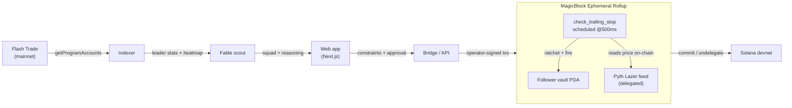

# Slipstream

**AI-scouted, you-approved, on-chain-guarded copy trading on Flash Trade.**

> _"I told it 'SOL, $1,000, conservative.' It scanned every live wallet on Flash Trade, showed me a
> squad of leaders with the liquidation heatmap to back it up, I drafted three, and when the trade
> turned, my trailing stop fired **on-chain, 50ms after the tick** — while the leader kept bleeding."_

Slipstream turns copy trading into a product you actually control. An agent reads live Flash Trade
leaderboard analytics, proposes a squad of 3–5 leaders **within your risk constraints**, and you
approve who to draft. The position is then mirrored into a vault delegated to a **MagicBlock
Ephemeral Rollup**, where an autonomous on-chain crank ratchets a trailing stop against a 50ms Pyth
Lazer feed and fires protective closes as zero-fee ER transactions.

Built for **Solana Blitz v5** (theme: Trading). Mandatory MagicBlock ER integration ✓ · Flash Trade
integration ✓.

---

## The honest framing

This demo uses **live Flash Trade leader data from mainnet** and executes the **ER risk-management
engine on devnet with real Pyth prices**. In production, the Flash trade-execution bridge (V2
tx-builder open/close endpoints) connects at the mirror step. For the hackathon, the ER
trailing-stop and risk engine is **fully functional against live market data** — the indexer is the
bridge: it reads real Flash mainnet leader positions and writes a *scaled* position into the devnet
ER vault. We never claim the follower's position is a live Flash basket.

---

## Why this is the build

The Flash Trade judge described, on the kickoff stream, exactly this product: *"huge players who are
killing it… feed those analytics to an AI agent, and the agent decides who to copy, maybe 3 or 5,"*
human inputs first (**not** an autonomous bot), liquidation heatmaps as the analytics, gamified
approve-to-follow UX, and *"point your AI at the example repo."* Every one of those maps to a layer
below.

| Layer | What it is | Status |
|------|------------|--------|
| 1 · Your mandate | Market, allocation, leverage ceiling, trailing stop, risk tolerance. The agent only acts inside them. | ✅ |
| 2 · Analytics engine | Index live Flash positions → leader stats + **liquidation heatmap**. | ✅ live (525 positions / 420 leaders) |
| 3 · Fable scout | One Claude (Fable 5) call: analytics + constraints → squad of 3–5 with per-leader reasoning. Deterministic ranker fallback. | ✅ |
| 4 · Approve to draft | Swipe right to draft a leader, left to skip (buttons too). Nothing trades without approval. | ✅ |
| 5 · ER guard engine | Anchor program: vault delegated to ER, scaled mirror, **trailing stop fires on-chain at tick speed**, settles to base. | ✅ deployed devnet |

---

## Architecture



**The differentiator — the crank.** `schedule_stop_crank` schedules `check_trailing_stop` to run
*inside the ER itself* every 500ms (via `MagicBlockInstruction::ScheduleTask`). The guard reads the
oracle account on-chain and ratchets/fires the stop with **zero client transactions** — proven on
devnet at **63 autonomous on-chain ticks in 31 seconds**. That is the demo money shot: protective
risk decisions executing autonomously on-chain at tick speed, no external keeper.

**The proof — guarded vs held.** The dashboard charts your equity against the leader's hold-through
path on the same price scenario. The two lines track together through the drawdown, then yours locks
at the stop while the leader's keeps bleeding — the value of the guard, drawn live.

---

## On-chain program — `copy_engine`

Deployed to devnet: `3yqVR6fFZVxwKy5CqY968ZdVKJWVtqr4jANi98NmVovz`

| Instruction | Layer | Notes |
|---|---|---|
| `init_vault` | base | Stores owner + **operator** + feed + risk caps (allocation, leverage, trail bps). |
| `delegate_vault` | base | Hands the vault PDA to the ER (optionally pinned to the feed's validator). |
| `open_position` | ER | Operator mirrors a scaled position; enforced under the leverage ceiling. |
| `check_trailing_stop` | ER | **Reads the Pyth feed on-chain**, ratchets the high-water stop, fires on cross. |
| `schedule_stop_crank` | ER | Schedules the guard to run autonomously inside the ER. |
| `apply_tick` / `close_position` | ER | Deterministic tick (demo/stress) and manual close. |
| `commit_vault` / `undelegate_vault` | ER | Flush state to base / return ownership (owner can exit anytime). |

**Signing model (revocable control):** ER mutations are signed by the `operator` key (the bridge),
which the owner sets at init and can revoke by undelegating at any time.

**Oracle:** Pyth Lazer feed accounts are delegated into the ER (PriceUpdateV2 layout, ~50–200ms).
The exponent is stored as a positive magnitude on the ER — decoded with `-exponent.abs()` both
on-chain (`oracle.rs`) and client-side.

---

## Built on `flash-trade/examples-v2`

The Flash judge's reference repo ([flash-trade/examples-v2](https://github.com/flash-trade/examples-v2))
ships a `copy-trade` example — mirror a leader's V2 basket, non-custodially. Slipstream is the
product layer on top of it:

- **Leader analytics** index Flash **V1** (the large, liquid population — 500+ live positions) for
  the leaderboard + liquidation heatmap the scout reasons over.
- **Mirror semantics** follow the example's hard-won discipline, ported in `flash/mirror-plan.ts`:
  diff baskets → `OPEN / GROW / SHRINK / CLOSE`, **size by collateral ratio (never raw size)**,
  hard-cap each mirror, and respect the **$11 collateral floor** (GOTCHAS §14) — too-small mirrors
  are skipped, not faked.
- **The V2 trade leg is real:** `flash/v2.ts` is a faithful client for the live V2 REST API
  (`/v2/owner`, `/v2/transaction-builder/*`, with `err`-in-200 handling). Dry-run the plan for any
  leader:

  ```bash
  pnpm mirror-plan <leaderPubkey> 1000 100      # or: GET /mirror-plan?owner=…&allocationUsd=…
  ```

Slipstream's twist: instead of replaying the mirror straight onto Flash, it routes the **approved**
mirror through the ER guard vault, which adds the autonomous on-chain trailing stop, then settles —
the same blessed mirror discipline, plus risk management the leader doesn't have.

## Run it locally

**Prerequisites:** Node 22 + pnpm, a funded **devnet burner** keypair (never your main wallet), and
optionally an `ANTHROPIC_API_KEY` for the Fable scout (without it, the deterministic ranker is used).

```bash
# 1. install
pnpm install
pnpm -C web install

# 2. configure — copy and fill (.env is gitignored)
cp .env.example .env
#   WALLET_KEYPAIR_PATH=./keypairs/burner-devnet.json   (devnet burner)
#   ANTHROPIC_API_KEY=...                                (optional)

# 3. run the API (Flash indexer + scout + ER bridge) on :8787
pnpm api

# 4. run the web app on :3000
pnpm -C web dev
```

Open http://localhost:3000 → set your mandate → draft a squad → watch the guard run on the dashboard
→ hit **Simulate drawdown** to see the trailing stop fire on-chain.

**Verify the engine directly (devnet):**

```bash
pnpm test:er      # full ER lifecycle: delegate → open → tick → stop → undelegate
pnpm test:crank   # THE showcase: schedule a 500ms crank, watch ticks climb with zero client txs
```

---

## Repo layout

```
programs/copy-engine/   Anchor program — vault, ER guard engine, oracle read, crank
indexer/                Flash V1 leader discovery (getProgramAccounts) → stats + heatmap
agent/                  Fable scout — analytics + constraints → squad + reasoning (+ fallback)
bridge/                 ER session lifecycle + scaled mirror + stress driver (operator-signed)
server/                 Unified HTTP API the web app consumes
web/                    Next.js 16 + Tailwind v4 + Motion dashboard (3 screens)
tests/                  Proven devnet lifecycle + crank tests
```

## Tech stack

Anchor · `ephemeral-rollups-sdk` · `magicblock-magic-program-api` (cranks) · Pyth Lazer · Flash
Trade (V1 program indexing + V2 tx-builder bridge) · Solana web3.js · Next.js 16 · Tailwind v4 ·
Motion · Claude **Fable 5**.

## Security

Devnet + a dedicated burner only; keys and RPC live in a gitignored `.env`. All trade/amount inputs
are validated at the API boundary and capped. No secrets in source.

---

Built on [MagicBlock](https://docs.magicblock.gg) Ephemeral Rollups for
[Solana Blitz v5](https://hackathon.magicblock.app).
