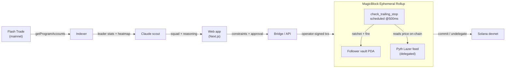
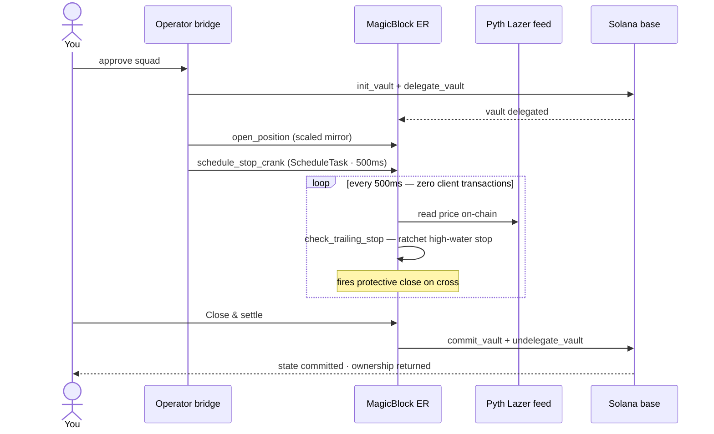

# Slipstream

**The AI scout that drafts your Flash Trade squad — and guards it on-chain.**

> _"I told it 'SOL, $1,000, conservative.' It scanned every live wallet on Flash Trade, ranked them
> against the liquidation heatmap, and drafted me a squad. I approved three — and when the trade
> turned, a trailing stop fired **on-chain, inside a MagicBlock rollup**, while the leader I copied
> kept bleeding."_

You don't have a stop-loss problem — you have a **"who do I follow, and how much do I risk"**
problem. Slipstream is the **decision layer** for Solana perps: an AI agent reads the live Flash
Trade leaderboard and liquidation heatmap, drafts a squad of 3–5 leaders **inside your risk limits**,
you approve who to copy, and the mirrored position is delegated to a **MagicBlock Ephemeral Rollup**
where an autonomous on-chain crank trails a stop the leader never had.

It's also **Claude-native**: the entire product is operable from Claude Code via an 8-tool MCP
server — scout, draft, follow, and watch your guard, from chat.

Built for **Solana Blitz v5** (theme: Trading). MagicBlock ER ✓ · Flash Trade ✓ · Claude MCP ✓.

**[▶ Live app](https://slipstream-liard.vercel.app)** · **[On-chain program ↗](https://explorer.solana.com/address/3yqVR6fFZVxwKy5CqY968ZdVKJWVtqr4jANi98NmVovz?cluster=devnet)** (devnet)

---

## Not another stop-loss tool

A trailing stop is *one feature* inside Slipstream — not the product. The product is the decision
that comes **before** the trade: who to copy, and how much to risk.

| | A stop-loss tool | **Slipstream** |
|---|---|---|
| Answers | "How do I exit?" | "Who do I follow, how much, and how do I exit?" |
| Input | A position you already opened | A risk mandate (market · budget · leverage ceiling · trail) |
| Intelligence | None — you pick everything | AI scout reads 400+ live Flash leaders + the liquidation heatmap, drafts a squad |
| Operable from | A web UI | A web UI **and Claude Code** — an 8-tool MCP server |
| The on-chain guard | The whole product | The safety net under a *copied* position |

---

## Why this is the build

The Flash Trade judge described, on the kickoff stream, exactly this product: *"huge players who are
killing it… feed those analytics to an AI agent, and the agent decides who to copy, maybe 3 or 5,"*
human inputs first (**not** an autonomous bot), liquidation heatmaps as the analytics, gamified
approve-to-follow UX, and *"point your AI at the example repo."* Every one of those maps to a layer
below.

| Layer | What it is | Status |
|------|------------|--------|
| 1 · Your mandate | Market, allocation, leverage ceiling, trailing stop, risk tolerance. The agent only acts inside them. | ✅ |
| 2 · Analytics engine | Index live Flash positions → leader stats + **liquidation heatmap**. | ✅ live (525 positions / 420 leaders) |
| 3 · Claude scout | One Claude (Sonnet 4.6) call: analytics + constraints → squad of 3–5 with per-leader reasoning. Deterministic ranker fallback. | ✅ |
| 4 · Approve to draft | Swipe right to draft a leader, left to skip (buttons too). Nothing trades without approval. | ✅ |
| 5 · ER guard engine | Anchor program: vault delegated to ER, scaled mirror, **trailing stop fires on-chain at tick speed**, settles to base. | ✅ deployed devnet |

---

## How it works


## Architecture



### The autonomous guard, step by step



**The differentiator — the crank.** `schedule_stop_crank` schedules `check_trailing_stop` to run
*inside the ER itself* every 500ms (via `MagicBlockInstruction::ScheduleTask`). The guard reads the
oracle account on-chain and ratchets/fires the stop with **zero client transactions** — proven on
devnet at **63 autonomous on-chain ticks in 31 seconds**. That is the demo money shot: protective
risk decisions executing autonomously on-chain at tick speed, no external keeper.

**The proof — guarded vs held.** The dashboard charts your equity against the leader's hold-through
path on the same price scenario. The two lines track together through the drawdown, then yours locks
at the stop while the leader's keeps bleeding — the value of the guard, drawn live.

---

## On-chain program — `copy_engine`

Deployed to devnet: `3yqVR6fFZVxwKy5CqY968ZdVKJWVtqr4jANi98NmVovz`

| Instruction | Layer | Notes |
|---|---|---|
| `init_vault` | base | Stores owner + **operator** + feed + risk caps (allocation, leverage, trail bps). |
| `delegate_vault` | base | Hands the vault PDA to the ER (optionally pinned to the feed's validator). |
| `open_position` | ER | Operator mirrors a scaled position; enforced under the leverage ceiling. |
| `check_trailing_stop` | ER | **Reads the Pyth feed on-chain**, ratchets the high-water stop, fires on cross. |
| `schedule_stop_crank` | ER | Schedules the guard to run autonomously inside the ER. |
| `apply_tick` / `close_position` | ER | Deterministic tick (demo/stress) and manual close. |
| `commit_vault` / `undelegate_vault` | ER | Flush state to base / return ownership (owner can exit anytime). |

**Signing model (revocable control):** ER mutations are signed by the `operator` key (the bridge),
which the owner sets at init and can revoke by undelegating at any time.

**Oracle:** Pyth Lazer feed accounts are delegated into the ER (PriceUpdateV2 layout, ~50–200ms).
The exponent is stored as a positive magnitude on the ER — decoded with `-exponent.abs()` both
on-chain (`oracle.rs`) and client-side.

---

## Built on `flash-trade/examples-v2`

The Flash judge's reference repo ([flash-trade/examples-v2](https://github.com/flash-trade/examples-v2))
ships a `copy-trade` example — mirror a leader's V2 basket, non-custodially. Slipstream is the
product layer on top of it:

- **Leader analytics** index Flash **V1** (the large, liquid population — 500+ live positions) for
  the leaderboard + liquidation heatmap the scout reasons over.
- **Mirror semantics** follow the example's hard-won discipline, ported in `flash/mirror-plan.ts`:
  diff baskets → `OPEN / GROW / SHRINK / CLOSE`, **size by collateral ratio (never raw size)**,
  hard-cap each mirror, and respect the **$11 collateral floor** (GOTCHAS §14) — too-small mirrors
  are skipped, not faked.
- **The V2 trade leg is real:** `flash/v2.ts` is a faithful client for the live V2 REST API
  (`/v2/owner`, `/v2/transaction-builder/*`, with `err`-in-200 handling). Dry-run the plan for any
  leader:

  ```bash
  pnpm mirror-plan <leaderPubkey> 1000 100      # or: GET /mirror-plan?owner=…&allocationUsd=…
  ```

Run live against a real V2 leader — the cap and the $11 floor actually fire:

```
$ pnpm mirror-plan 3RsAgsA4DBQ9GyncLNYQaoAU2txdaFamFjMs7MeCKqoR 1000 100
leader 3RsAgsA4… — 2 live V2 position(s)
OPEN  LONG NATGAS   — leader $17 @ 6.8x  → mirror $100.00 (14.60 USDC collateral)
SKIP  LONG CRUDEOIL — mirror collateral $5.47 < $11 floor
```

(Live V2 is currently sparse — a handful of active baskets — so leader *discovery* and the
analytics/heatmap run on the deeper V1 population; the V2 client above is the real mirror leg.)

Slipstream's twist: instead of replaying the mirror straight onto Flash, it routes the **approved**
mirror through the ER guard vault, which adds the autonomous on-chain trailing stop, then settles —
the same blessed mirror discipline, plus risk management the leader doesn't have.

## Claude-native: the Slipstream MCP

Slipstream ships an **MCP server** so Claude Code becomes your copy-trading copilot — scout
the leaderboard, draft a squad, and watch your guarded vaults, all from chat.

```bash
pnpm api                                       # the API the MCP wraps
# Claude Code auto-discovers .mcp.json, or add it manually:
claude mcp add slipstream -- npx tsx mcp/server.ts
```

Tools: `slipstream_leaders` · `slipstream_heatmap` · `slipstream_scout` · `slipstream_follow` ·
`slipstream_sessions` · `slipstream_status` · `slipstream_simulate_drawdown` · `slipstream_mirror_plan`.

Then, in Claude Code: *"Scout SOL leaders for a $1k conservative book, follow the top 3, and watch my
guard."* — Claude scouts, provisions a guarded ER vault, mirrors the squad, and reports the live
trailing-stop status as it ratchets on-chain.

## Run it locally

**Prerequisites:** Node 22 + pnpm, a funded **devnet burner** keypair (never your main wallet), and
optionally an `ANTHROPIC_API_KEY` for the Claude scout (without it, the deterministic ranker is used).

```bash
# 1. install
pnpm install
pnpm -C web install

# 2. configure — copy and fill (.env is gitignored)
cp .env.example .env
#   WALLET_KEYPAIR_PATH=./keypairs/burner-devnet.json   (devnet burner)
#   ANTHROPIC_API_KEY=...                                (optional)

# 3. run the API (Flash indexer + scout + ER bridge) on :8787
pnpm api

# 4. run the web app on :3000
pnpm -C web dev
```

Open http://localhost:3000 → set your mandate → draft a squad → watch the guard run on the dashboard
→ hit **Replay a winning move** or **Replay drawdown** to see the trailing stop fire on-chain.

**Verify the engine directly (devnet):**

```bash
pnpm test:er      # full ER lifecycle: delegate → open → tick → stop → undelegate
pnpm test:crank   # THE showcase: schedule a 500ms crank, watch ticks climb with zero client txs
```

---

## Repo layout

```
programs/copy-engine/   Anchor program — vault, ER guard engine, oracle read, crank
indexer/                Flash V1 leader discovery (getProgramAccounts) → stats + heatmap
agent/                  Claude scout — analytics + constraints → squad + reasoning (+ fallback)
bridge/                 ER session lifecycle + scaled mirror + stress driver (operator-signed)
server/                 Unified HTTP API the web app consumes
web/                    Next.js 16 + Tailwind v4 + Motion dashboard (3 screens)
tests/                  Proven devnet lifecycle + crank tests
```

## Tech stack

Anchor · `ephemeral-rollups-sdk` · `magicblock-magic-program-api` (cranks) · Pyth Lazer · Flash
Trade (V1 program indexing + V2 tx-builder bridge) · Solana web3.js · Next.js 16 · Tailwind v4 ·
Motion · Claude **Sonnet 4.6**.

## Security

Devnet + a dedicated burner only; keys and RPC live in a gitignored `.env`. All trade/amount inputs
are validated at the API boundary and capped. No secrets in source.

---

## Verified on devnet

- **Autonomous crank** — 63 on-chain `check_trailing_stop` ticks in 31s with **zero client
  transactions**: the guard runs *itself* inside the ER (`pnpm test:crank`).
- **On-chain oracle read** — the crank decodes the delegated Pyth Lazer account in-program, ratchets
  the high-water stop, and fires; every fire is an inspectable ER transaction with a real signature
  in the dashboard tx feed.
- **Full delegation lifecycle** — delegate → open → tick → stop → commit → undelegate, proven
  end-to-end (`pnpm test:er`).

## Honest limitations

- **Leader discovery runs on Flash V1** (the deep, liquid population). The V2 mirror client
  (`flash/v2.ts` — real tx-builders, collateral-ratio sizing, $11 floor) is wired into the live
  `/mirror-plan` dry-run, **not** the on-chain demo path: the guarded position is a *scaled mirror*
  in the ER vault, not yet a live V2 basket. We never claim otherwise.
- **The dashboard replays** (a winning move and an adverse drawdown) drive a scripted price path via
  `apply_tick` so the stop fires on demand in seconds — the trailing-stop logic and on-chain Pyth read
  they exercise are real; the price path is illustrative (labeled on-screen).
- **The liquidation heatmap** approximates distance-to-liquidation (V1 open interest; maintenance
  params not modeled) — labeled "approx." in the UI.
- **Crank cadence is 500ms and the demo is SOL-centric** — both are configuration, not limits.

---

Built on [MagicBlock](https://docs.magicblock.gg) Ephemeral Rollups for
[Solana Blitz v5](https://hackathon.magicblock.app).
